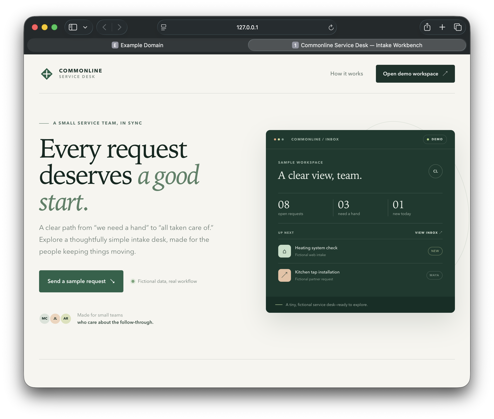
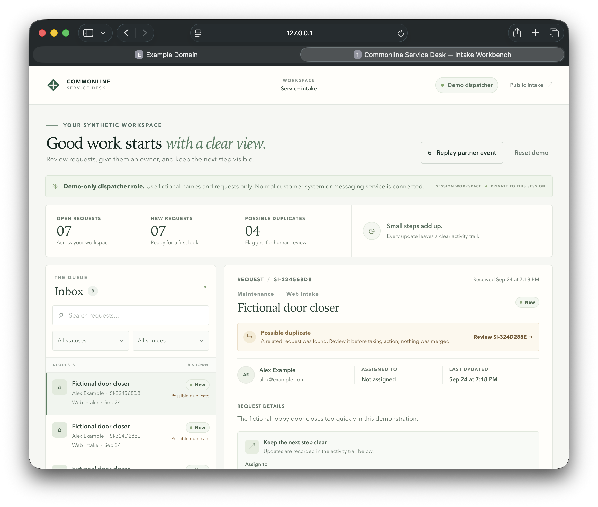

# Commonline Service Desk — Service Intake Workbench

A small, **fictional-data** full-stack portfolio demo: a public service request becomes a PostgreSQL record, then moves through a staff inbox, assignment, work, resolution, and an activity trail. A signed partner webhook and a reviewer-friendly replay button demonstrate idempotent ingestion. Nothing sends messages to customers or connects to a real service business.

This is a fresh, separate codebase. No source, history, credentials, or client records were copied from a private project. It was built with AI assistance; repository ownership should not be mistaken for a claim that every line was personally handwritten by Eduardo Hernandez.

## Screenshots

The captures below show the locally running, fictional-data demo. They are not claims of a hosted deployment.





[Narrow-screen staff view](docs/screenshots/staff-workspace-narrow.png)

## Reviewer path

1. At `/`, submit a request using a fictional name and a reserved demo email such as `alex@example.com`.
2. Open the demo workspace. This deliberately grants a **demo-only** dispatcher role for your browser's synthetic workspace; it is **not production authentication**.
3. In `/workspace`, find the request, assign it, start work, resolve it, and inspect the saved event history. A second request with the same fictional email and category is flagged as a possible duplicate, never auto-merged.
4. Replay the fictional partner event twice. The second call returns the original request with `replayed: true` and creates no extra row.
5. Reset your workspace to the original fictional examples. Reset does not affect other visitors' workspaces.

## What this proves

- Next.js App Router and React/TypeScript public/staff UI, with responsive inbox/detail layouts and accessible form/error states.
- Node runtime API routes with Zod validation, structured errors, same-origin checks on browser mutations, and a signed short-lived HttpOnly demo-session cookie.
- PostgreSQL persistence for workspaces, requests, append-only workflow events, possible-duplicate links, and idempotency receipts. Status changes and events commit in one transaction.
- A partner endpoint that verifies an HMAC over the workspace ID, timestamp, replay key, and raw request body. Replay keys are serialized with a transaction-level advisory lock, so concurrent copies resolve to one request. The browser replay control calls a separate safe demo route and never receives the signing secret.
- A local API/database journey suite that exercises validation, role boundaries, workspace isolation, transitions, history, concurrent replay, signature rejection, and reset.

## Local setup

Requires Node 24+ and PostgreSQL 16+. Create a **dedicated** local database. The SQL migration is source-controlled in [`db/001_init.sql`](db/001_init.sql).

```bash
npm ci
cp .env.example .env.local
# Edit .env.local with your own local database URL and three distinct random secrets.
npm run db:migrate
npm run dev -- -p 3006
```

In a second terminal, with the local server running:

```bash
npm run typecheck
npm run lint
npm run test:integration
npm run build
```

The integration script refuses a non-local HTTP target and does not delete database rows by default. CI alone opts into the cleanup deletion proof against its temporary local database. Environment values in `.env.local` are ignored by Git. `GET /api/health` checks database reachability without revealing the connection string.

## API shape

| Route | Purpose |
| --- | --- |
| `POST /api/intake` | Validate and save a fictional public request. |
| `POST /api/demo/enter` | Create or enter a session-scoped demo dispatcher workspace and seed examples. |
| `GET /api/requests`, `GET /api/requests/:id` | Staff inbox and request with event history. |
| `PATCH /api/requests/:id` | Assign, start, resolve, or reopen, writing an event atomically. |
| `POST /api/demo/replay` | Replay one fixed fictional partner event without exposing a secret. |
| `POST /api/demo/reset` | Reset only the current workspace. |
| `POST /api/partner/webhook` | HMAC-verified partner ingestion for a known demo workspace. |

The partner endpoint requires `Idempotency-Key` (equal to the JSON `externalId`), `X-Workbench-Workspace-Id`, `X-Workbench-Timestamp` (Unix seconds within five minutes), and `X-Workbench-Signature: sha256=<hex>`. The signature is HMAC-SHA256 of `workspaceId + "." + timestamp + "." + idempotencyKey + "." + rawBody`, using the server-only `PARTNER_WEBHOOK_SECRET`. Use a local test secret; never publish the secret or a real customer payload. Full payloads and response envelopes are in [`SPEC.md`](SPEC.md).

## Demo boundaries

- **Fictional submissions only.** Email domains are restricted to reserved examples (`example.com` and `.test`/`.example`/`.invalid`); names and descriptions must also be invented by the visitor. No real customer identity should be entered.
- Browser sessions and demo workspaces expire after 24 hours. A protected daily cleanup removes expired workspaces and their records; hosting outside Vercel needs an equivalent scheduled call to `/api/maintenance/cleanup`. Each workspace has a 30-request cap, and database-backed daily quotas bound public intake and new workspaces. Rate limits reduce abuse but are not a production anti-abuse system.
- The public demo-entry action intentionally grants the dispatcher role. It is a walkthrough convenience, not identity verification, tenant authorization for a production business, or a model of real employee access.
- The activity trail is append-only during normal workflow; a user-requested demo reset deletes that visitor's synthetic history. Duplicate detection is advisory, not entity resolution.
- The current build has no outbound email/SMS, payments, production AI calls, real partner integration, or real customer data. It should not be deployed as a customer service system without further authentication, abuse protection, data governance, and operational controls.

## Architecture

`src/app` contains the public and workspace screens plus API routes. `src/lib` holds validation, signed demo sessions, PostgreSQL operations, and workflow transitions. `db/001_init.sql` is an idempotent first migration. `scripts/integration.mts` verifies the running server against a dedicated local database.
